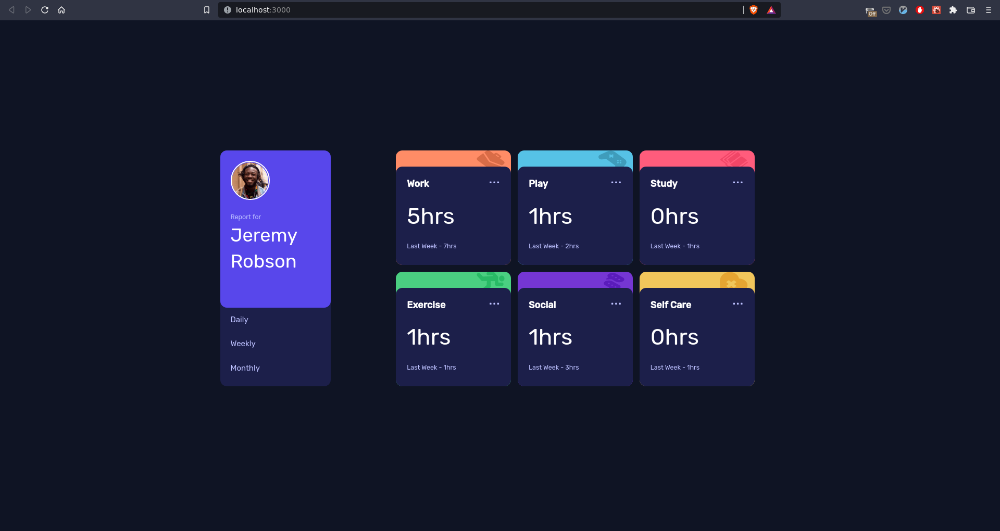

# Frontend Mentor - Time tracking dashboard solution

This is a solution to the [Time tracking dashboard challenge on Frontend Mentor](https://www.frontendmentor.io/challenges/time-tracking-dashboard-UIQ7167Jw). Frontend Mentor challenges help you improve your coding skills by building realistic projects. 

### The challenge

Users should be able to:

- View the optimal layout for the site depending on their device's screen size
- See hover states for all interactive elements on the page
- Switch between viewing Daily, Weekly, and Monthly stats

### Screenshot

### Links

- Solution URL: [Time Tracking Dashboard](https://francis-time-tracking-dashboard.netlify.app/)

## My process

### Built with

- Semantic HTML5 markup
- CSS custom properties
- Flexbox
- CSS Grid
- [React](https://reactjs.org/) - JS library

### What I learned

Use this section to recap over some of your major learnings while working through this project. Writing these out and providing code samples of areas you want to highlight is a great way to reinforce your own knowledge.

- How to use Props in react, the container component
- Populating data from children component to ancestors
components using state
- How to think in components
- How to work with svgs in react
To see how you can add code snippets, see below:

### Continued development

- I would like to take on more challenges to fully understand react, then work on connecting a react app to a node js backend

### Useful resources

- [Lifting state up](https://reactjs.org/docs/lifting-state-up.html) - This helped me to understand how state works between components in react. I wanted to pass code from a child component back to the parent then to a sibling component and this helped with that
- [Hover effects in javascript](https://javascript.info/bubbling-and-capturing) - This article gave me a basic understanding of bubbling in javascript
- [Hover effects in React](https://reactjsexample.com/a-react-component-that-notifies-its-children-of-hover-interactions/) - This is an amazing article that made me understand bubbling in react and that onMouseEnter and onMouseLeave  are not triggered by hover events bubbling up from child elements.
- [Writing better commit messages](https://www.freecodecamp.org/news/writing-good-commit-messages-a-practical-guide/) - This is an article on writing better commit messages, something I want to get good at early.

## Author

- Website - [Francis shonubi](https://github.com/olad5)
- Frontend Mentor - [@olad5](https://www.frontendmentor.io/profile/olad5)
- Twitter - [@_olad5](https://www.twitter.com/olad5)

